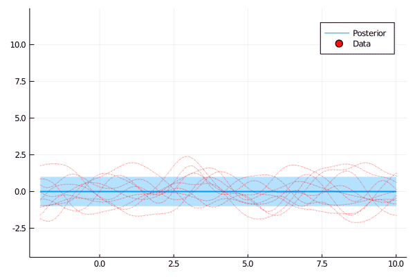

# AbstractGPs

[](https://JuliaGaussianProcesses.github.io/AbstractGPs.jl/dev)
[](https://github.com/JuliaGaussianProcesses/AbstractGPs.jl/actions/workflows/CI.yml?query=branch%3Amaster)
[](https://codecov.io/gh/JuliaGaussianProcesses/AbstractGPs.jl)
[](https://github.com/invenia/BlueStyle)
[](https://github.com/SciML/ColPrac)
[](https://zenodo.org/badge/latestdoi/254674526)


AbstractGPs.jl is a package that defines a low-level API for working with Gaussian processes (GPs), and basic functionality for working with them in the simplest cases. As such it is aimed more at developers and researchers who are interested in using it as a building block than end-users of GPs.



## Installation 

AbstractGPs is an officially registered Julia package, so the following will install AbstractGPs using the Julia's package manager:

```julia
] add AbstractGPs
```

## Example
```julia
# Import packages.
using AbstractGPs, Plots

# Generate toy synthetic data.
X = rand(10)
Y = sin.(rand(10))

# Define GP prior with Matern32 kernel
f = GP(Matern32Kernel())

# Finite projection at the inputs `X`
fx = f(X, 0.001)

# Data's log-likelihood w.r.t prior GP `f`. 
logpdf(fx, Y)

# Exact posterior given `Y`.
p_fx = posterior(fx, Y)

# Data's log-likelihood w.r.t posterior GP `p_fx`. 
logpdf(p_fx(X), Y)

# Plot posterior.
scatter(X, Y; label="Data")
plot!(-0.5:0.001:1.5, p_fx; label="Posterior")
```


## Related Julia packages

- [AbstractGPsMakie.jl](https://github.com/JuliaGaussianProcesses/AbstractGPsMakie.jl/) - Plotting GPs with [Makie.jl](https://github.com/JuliaPlots/Makie.jl/).
- [BayesianLinearRegressors.jl](https://github.com/JuliaGaussianProcesses/BayesianLinearRegressors.jl) - Accelerated inference in GPs with a linear kernel. Built on types which implement this package's APIs.
- [ApproximateGPs.jl](https://github.com/JuliaGaussianProcesses/ApproximateGPs.jl/) - Approximate inference for GPs, both for sparse approximations and non-Gaussian likelihoods. Built on types which implement this package's APIs.
- [GPLikelihoods.jl](https://github.com/JuliaGaussianProcesses/GPLikelihoods.jl/) - Non-Gaussian likelihood functions to use with GPs.
- [KernelFunctions.jl](https://github.com/JuliaGaussianProcesses/KernelFunctions.jl/) - Kernel functions for machine learning.
- [Stheno.jl](https://github.com/JuliaGaussianProcesses/Stheno.jl) - Building probabilistic programmes involving GPs. Built on types which implement this package's APIs.
- [TemporalGPs.jl](https://github.com/JuliaGaussianProcesses/TemporalGPs.jl) - Accelerated inference in GPs involving time. Built on types which implement this package's APIs.


## Issues/Contributing

If you notice a problem or would like to contribute by adding more kernel functions or features please [submit an issue](https://github.com/JuliaGaussianProcesses/AbstractGPs.jl/issues).
